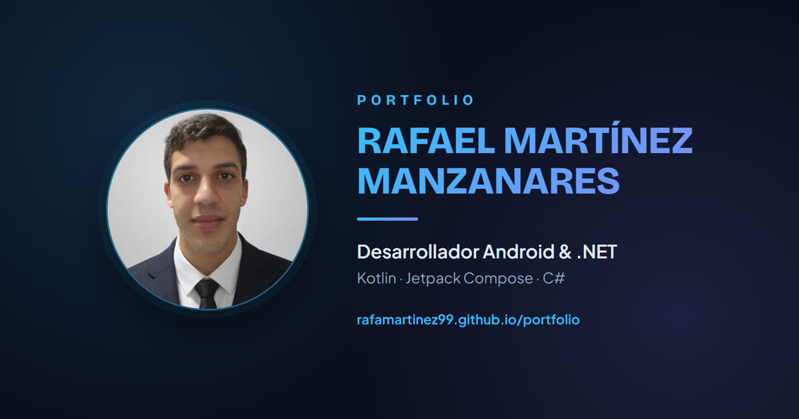

<div align="center">

# Portfolio · Rafael Martínez Manzanares




**[Ver portfolio en vivo →](https://rafamartinez99.github.io/portfolio)**

</div>

---

Portfolio personal desarrollado con **HTML, CSS y JavaScript puro**, sin frameworks, librerías ni herramientas de build. Diseño oscuro, responsive y centrado en el rendimiento.

---

## Características

- **Responsive**: adaptado a móvil, tablet y escritorio.
- **Tema oscuro** con paleta de marca y degradados.
- **Animaciones sutiles**: efecto de escritura, reveal al hacer scroll, fondos animados y luz que sigue al cursor.
- **Stack de tecnologías interactivo**: al pasar el cursor (o tocar) sobre cada tecnología, muestra en qué proyectos se ha usado.
- **Página 404 personalizada** con la misma estética.
- **Descarga de CV** en PDF.
- **Páginas de detalle** individuales para cada proyecto.

---

## Estructura del proyecto

```
├── index.html          ← Página principal
├── 404.html            ← Página de error personalizada
├── proyectos/          ← Página de detalle de cada proyecto
├── css/
│   └── style.css
├── js/
│   ├── script.js       ← Lógica de la página principal
│   └── common.js       ← Compartido (404 y páginas de proyecto)
├── img/                ← Imágenes en WebP + iconos SVG
├── docs/               ← CV en PDF
├── favicon.svg
├── sitemap.xml         ← SEO
└── robots.txt          ← SEO
```

---

## Tecnologías

| Área | Tecnología |
|------|-----------|
| Estructura | HTML5 |
| Estilos | CSS3 (custom properties, grid, flexbox) |
| Interacción | JavaScript (vanilla, sin frameworks) |
| Iconos | SVG inline |
| Hosting | GitHub Pages |
| SEO | sitemap.xml · robots.txt · JSON-LD · Open Graph |

---

## Decisiones técnicas destacadas

- **Cero dependencias**: HTML, CSS y JS puro, sin frameworks ni proceso de build. Carga rápida y fácil de mantener.
- **Iconos SVG inline en vez de Font Awesome**: se sustituyó la librería completa (~330 KB y varias peticiones que bloqueaban el render) por un sprite SVG con solo los iconos que se usan. Cero peticiones externas para iconos.
- **Imágenes WebP + lazy loading**: todas las imágenes convertidas a WebP y redimensionadas a su tamaño real de visualización; el peso total de la página bajó de **~9 MB a ~1 MB**. Se usa `loading="lazy"` y `width`/`height` explícitos para evitar saltos de layout (CLS).
- **Rendimiento (Lighthouse)**: ~98 Performance · 100 Accessibility · 100 Best Practices · 100 SEO.
- **SEO completo**: `sitemap.xml`, `robots.txt`, datos estructurados **JSON-LD** (schema.org `Person`) y meta tags **Open Graph / Twitter Card** para las previsualizaciones al compartir el enlace.
- **Accesibilidad**: estados de foco visibles con `:focus-visible` y respeto a `prefers-reduced-motion`.
- **Transiciones entre páginas** con la View Transitions API (en navegadores compatibles).

---

## Verlo en local

Al ser un sitio estático, basta con clonarlo y abrir `index.html`. Para evitar problemas con rutas, lo ideal es servirlo:

```bash
git clone https://github.com/rafamartinez99/portfolio.git
cd portfolio
python -m http.server 8000
# Abre http://localhost:8000
```

---

## Proyectos destacados

| Proyecto | Descripción | Stack |
|----------|-------------|-------|
| [SuperManzanares](https://rafamartinez99.github.io/portfolio/proyectos/supermanzanares.html) | App Android de supermercado (TFG). | Kotlin · Jetpack Compose · Firebase · Mapbox |
| [Granalladora APH](https://rafamartinez99.github.io/portfolio/proyectos/granalladora.html) | Monitorización industrial en tiempo real (Acerinox). | C# · .NET 8 · WPF · OPC UA · WCF |
| [Agente SFTP](https://rafamartinez99.github.io/portfolio/proyectos/agentesftp.html) | Agente de bandeja que sube archivos por SFTP (Acerinox). | C# · .NET 8 · SSH.NET |
| [EncryptorACX](https://rafamartinez99.github.io/portfolio/proyectos/encryptoracx.html) | Herramienta de cifrado de credenciales (Acerinox). | C# · .NET · WPF · AES |
| [StarWars Compose](https://rafamartinez99.github.io/portfolio/proyectos/starwars.html) | App Android que consume la API pública SWAPI. | Kotlin · Jetpack Compose · Retrofit |

---

## Contacto

[](mailto:rafamartineez99@gmail.com)
[](https://github.com/rafamartinez99)
[](https://linkedin.com/in/rafamartinez99)
